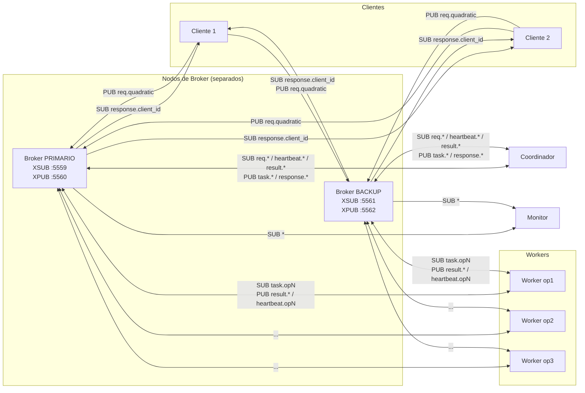
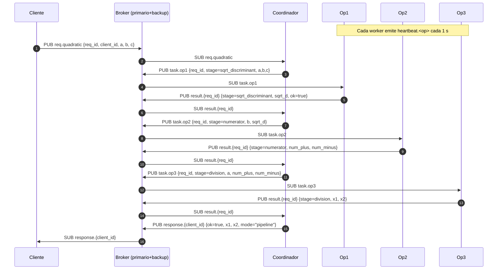
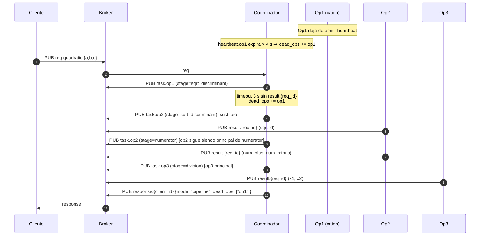
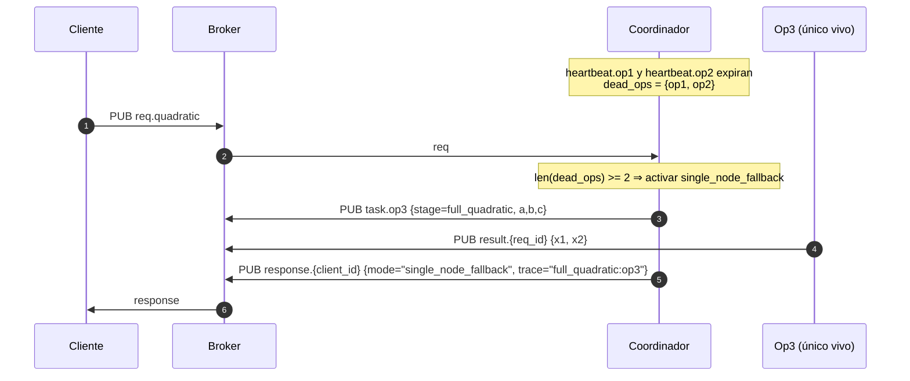
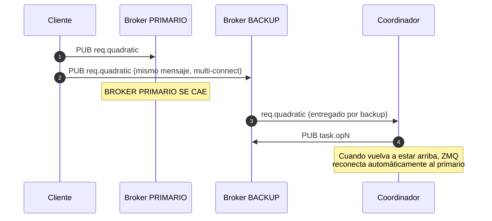

# Diagramas para el informe — Taller 3 (Pub/Sub con ZeroMQ)

> Los siguientes diagramas están escritos en sintaxis **Mermaid**, que se
> renderiza directamente en GitHub o en cualquier visor compatible
> (VS Code, Mermaid Live Editor: https://mermaid.live).

---

## 1. Diagrama de arquitectura

**Notas:**
- Cada componente (cliente, coordinador, worker, monitor) abre **un solo socket
  PUB y un solo socket SUB** que hacen `connect` a **los dos brokers a la vez**.
- ZMQ permite multi-connect: si uno de los dos brokers cae, el socket sigue
  entregando por el otro de forma transparente.
- Los receptores deduplican por `msg_id` para que la doble entrega no se
  procese dos veces.

---

## 2. Diagrama de secuencia — flujo normal (sin fallos)

---

## 3. Diagrama de secuencia — fallo de un worker (failover de etapa)

---

## 4. Diagrama de secuencia — dos workers caídos (single_node_fallback)

---

## 5. Diagrama de secuencia — caída del broker primario

> Como cada PUB hace connect a los dos brokers y cada SUB también, la caída
> de uno de ellos es invisible: el otro sigue entregando. La deduplicación
> por `msg_id` impide que el mismo mensaje sea procesado dos veces cuando
> ambos brokers están vivos.

---

## 6. Tabla de roles (igual que Talleres 1 y 2)

| Etapa                | Principal | Sustituto 1 | Sustituto 2 |
| -------------------- | --------- | ----------- | ----------- |
| sqrt_discriminant    | op1       | op2         | op3         |
| numerator            | op2       | op3         | op1         |
| division             | op3       | op1         | op2         |
